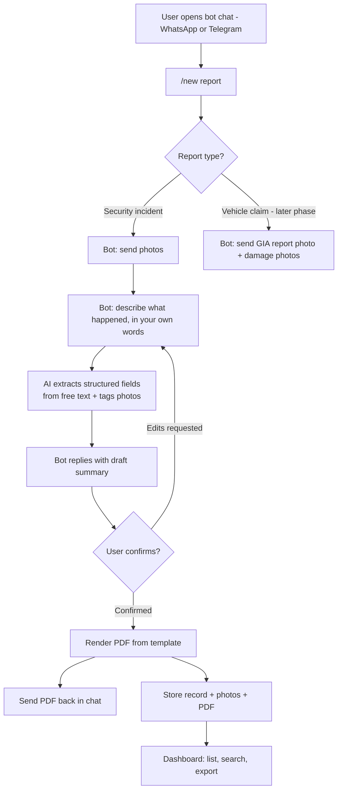
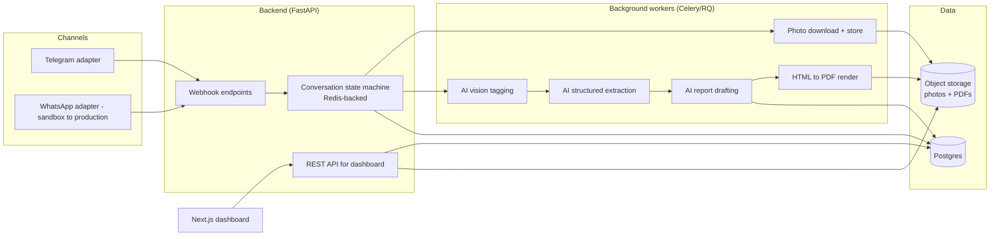

# Carlink AI Incident Reporting — System Proposal

Prepared as a working reference for planning and the next conversation with the client. Covers product flow, architecture, tech stack, data model, folder structure, AI pipeline, roadmap, and open questions to raise with the client.

---

## A. Where this fits in the business

From the Carlink Consultancy brief and claims-procedure notes:

- Carlink handles **TP claims (conventional method)**, **specialized TP claims (TMA)**, and **SJE (Single Joint Expert) reports** — with a longer-term ambition to offer **OD claims** services directly to insurers.
- Core bottlenecks called out explicitly: time spent inputting photos, manually entering damaged items, manually researching part prices, slow report generation (some cases take months/years), and workshops not paying on time.
- Stated targets: damage-item recognition accurate **≥70% on first pass, aiming for 90%**; report turnaround of **3 days or less**; eventually AI-estimated cost/damage at **~80% accuracy** for insurer-facing OD claims (also framed as a fraud-reduction feature).
- Every report still needs a human surveyor sign-off — **the AI drafts, it never finalizes.**

The near-term ask (the WhatsApp/Telegram + AI flow) is the front door to this entire pipeline. Security incident reporting is the simplest possible version of the same shape: photo in, structured questions, AI drafts a report. Build that shape once, generalize it to vehicle claims later.

Two report templates were provided as reference (`Resource/1A6D70C1.pdf` and `Resource/Carlink Consultancydocx 1.pdf`'s companion image) — both follow the same skeleton: **reporter info → incident metadata → description → people/witnesses → actions taken → category checklist**. That skeleton is the basis for the schema in section F.

---

## B. Input channels & the first prototype

**Decision: WhatsApp and Telegram are both first-class input channels from day one — they just roll out on different timelines, for practical reasons.**

WhatsApp's Business Cloud API requires Meta business verification, which can take days to weeks. That's calendar lead time, not development time — worth starting immediately regardless of when the build itself kicks off. Telegram's Bot API is free and self-serve (a bot token in minutes via @BotFather), so it's what the first working prototype runs on first. WhatsApp development doesn't have to wait for full approval either — Twilio's WhatsApp Sandbox or 360dialog give a working WhatsApp integration to build and test against right away, then the number swaps to the verified production one once Meta approval clears. The messaging layer is built as a swappable adapter (see section D) specifically so both channels sit behind the same conversation logic — a user filing a report shouldn't experience a different flow depending on which app they used.

**What the first working prototype demonstrates:

1. Send photos (e.g. vehicle accident scene or damaged parts) to **@carlink_reporter_bot** on Telegram.
2. Receive step-by-step interactive onboarding instructions (`/start`, `/new`, `/help`, `/cancel`).
3. Reply with a short text description ("Vehicle collision at Workshop Bay 2 around 2:15 PM, front bumper and right passenger door dented").
4. AI extracts structured fields, classifies **Accident Type** (*Frontal Collision*, *Side Impact*, etc.), lists **Damaged Parts**, rates **Severity**, and returns a summary preview.
5. Upon user confirmation (`confirm`), the bot renders an official **Incident & Damage Report PDF** with highlighted damage tags and sends it back in chat within seconds.

> [!NOTE]
> **Phase 0 Implementation Status: COMPLETED & OPERATIONAL**
> - **Telegram Bot Handle**: `@carlink_reporter_bot`
> - **AI Engine**: Multimodal Gemini / Claude structured extraction & vision analysis.
> - **PDF Rendering Engine**: Playwright (Headless Chromium) + Jinja2 HTML templates.
> - **Database & Storage**: `carlink.db` (SQLite) + `storage/incidents/{year}/{month}/{incident_id}/`.

---

## C. End-to-end product flow



The loop is deliberately short: **one round of follow-up questions, one draft, one confirmation.** Every extra back-and-forth is a reason someone stops using the bot. The AI should ask for everything it's missing in a single message, not one field at a time.

---

## D. System architecture



**Why this shape:**

- **Channel adapters** isolate Telegram/WhatsApp-specific webhook payloads behind one normalized `InboundMessage` interface, so the conversation logic, AI pipeline, and rendering code never know or care which app a message arrived from.
- **Conversation state in Redis** because Telegram/WhatsApp conversations are stateless HTTP webhooks by default — something has to remember "this chat is mid-way through describing incident #482."
- **Background workers** because AI calls (vision + drafting) and PDF rendering take a few seconds each; the webhook response to Telegram must return fast, so real work happens async and the bot messages the user when done.
- **Postgres + object storage split**: structured, queryable data (who/what/when/status) in Postgres; large binary files (photos, PDFs) in a bucket, referenced by URL. Keeps the database small and fast.
- **Dashboard talks to the same REST API**, not directly to the database — one source of truth for business logic (validation, permissions, status transitions).

---

## E. Tech stack decisions

| Layer | Recommendation | Why | Alternative considered |
|---|---|---|---|
| Messaging — Telegram | **Telegram Bot API**, live from day one | Free, self-serve setup, no verification wait, full media support — this is what the first prototype runs on | — |
| Messaging — WhatsApp | **WhatsApp Cloud API** via Twilio/360dialog sandbox first, Meta-verified production number once approved | Client's actual users will expect WhatsApp day to day; sandbox unblocks development immediately instead of waiting on Meta's verification queue | Direct Meta Cloud API only — simpler long-term, but nothing to build/test against until verification clears |
| Backend | **Python + FastAPI** | Best ecosystem for AI/vision work, async-native, typed request/response models (Pydantic) double as the report schema | Node.js/NestJS — fine choice too, but Python wins given how AI/image-heavy this system is |
| Background jobs | **Celery or RQ + Redis** | Photo processing and AI calls shouldn't block the webhook response | Simple `asyncio` background tasks — acceptable for the Tuesday prototype only, not production |
| AI model | **Claude (Anthropic), multimodal** | Single model handles both vision (photo understanding/damage tagging) and structured text extraction/drafting via one API; strong at following a strict JSON schema and at professional report-toned writing | GPT-4V/GPT-4o — comparable option, keep as a fallback provider behind the same interface |
| Database | **PostgreSQL**, hosted via **Supabase** for MVP speed | Relational data (reports, people, claims, payments) is inherently structured; Supabase bundles Postgres + file storage + auth so there's one thing to stand up, not four | Self-hosted Postgres — better long-term cost control, worth migrating to once volume justifies it |
| File storage | **Supabase Storage** (S3-compatible) | Comes free with the Postgres choice above; signed URLs for private photo/PDF access | Raw AWS S3 — more setup, same end result |
| PDF rendering | **HTML/Jinja2 templates → Playwright (headless Chromium) or WeasyPrint** | Templates can be styled to pixel-match the existing report formats (security incident, and later the insurance claim layouts); designers/non-engineers can tweak HTML/CSS without touching backend logic | `python-docx`/Word-based generation — more painful to keep visually consistent |
| Frontend (dashboard) | **Next.js (React) + TypeScript + Tailwind** | Fast to build CRUD/list/detail views; deploys trivially to Vercel; mobile-responsive for surveyors checking reports on-site | Plain React SPA — no real advantage over Next.js here |
| Auth | **Supabase Auth** | Free, integrates with the same Supabase project, supports role-based access (admin/surveyor/workshop viewer later) | Clerk/Auth0 — fine alternatives, extra vendor for no real gain at this stage |
| Hosting (MVP) | **Railway or Render** (backend + worker), **Vercel** (dashboard), **Supabase** (data/storage/auth) | All have workable free/low-cost tiers, near-zero ops overhead, fast to stand up before Tuesday | Self-managed VPS/Docker — better cost-per-scale, revisit once usage is real |

---

## F. Data model

Designed so the **security incident** report (near-term demo) and the **vehicle claim** report (main product) share a common backbone, with claim-specific fields layered on top.

**Shared core:**

- `Report` — id, type (`security_incident` / `vehicle_claim_od` / `vehicle_claim_tp` / `sje`), status (`draft` / `pending_review` / `confirmed` / `signed_off`), channel_source, created_at, confirmed_by
- `Reporter` — name, job title/role, contact
- `IncidentDetail` — date/time, location, category (multi-select), `accident_type` (e.g. Frontal Collision, Side Impact, Parked Hit & Run), `damaged_parts[]` (e.g. Front Bumper, Door, Headlight), `severity_level` (Minor/Moderate/Severe), `vehicle_details`, free-text description

- `PersonInvolved` — name, role (employee/visitor/contractor/other), department, contact
- `Witness` — name, contact, statement
- `ActionTaken` — immediate actions, reported_to_authorities (bool), reference/case number
- `PreventiveMeasure` — free text
- `Photo` — url, uploaded_at, ai_caption, ai_tags[], linked_entity (person/damage item/general)
- `AuditLogEntry` — report_id, actor, action, timestamp (every AI draft, human edit, and sign-off is logged — see section K)
- `ChannelIdentity` — phone_number, channel (`telegram`/`whatsapp`), external_user_id, linked reporter. Keys people by **phone number**, not by per-channel chat ID, so the same reporter's history stays intact whether they used WhatsApp today and Telegram last week — see section M for the reasoning.

**Vehicle-claim extensions (Phase 2+):**

- `Vehicle` — plate number, make, model, year
- `Claim` — claim type (OD/TP-direct/TP-conventional/SJE), insurer, workshop, appointed surveyor, appointed lawyer (conventional TP), discharge_voucher_status
- `DamageItem` — part name, severity, ai_confidence, estimated_cost, source_photo_id, disassembly_required (bool)
- `PartPrice` — part name, supplier, price, source (workshop-supplied / supplier lookup), last_updated
- `Payment` — claim_id, amount, invoice_ref, due_date, paid_at, status

---

## G. Repo & folder structure

```text
carlink-system/
├── apps/
│   ├── bot-service/                 # FastAPI: webhooks, AI orchestration, workers
│   │   ├── app/
│   │   │   ├── channels/            # telegram.py, whatsapp.py — adapter per platform
│   │   │   ├── conversation/        # state machine + Redis session store
│   │   │   ├── ai/                  # extraction.py, vision.py, drafting.py (Claude calls)
│   │   │   ├── reports/             # schema.py — Pydantic models per report type
│   │   │   ├── rendering/           # Jinja templates + PDF renderer
│   │   │   ├── api/                 # REST endpoints consumed by the dashboard
│   │   │   ├── db/                  # SQLAlchemy models + Alembic migrations
│   │   │   └── workers/             # Celery/RQ task definitions
│   │   └── tests/
│   └── dashboard/                   # Next.js admin app
│       ├── app/                     # routes: /reports, /reports/[id], /settings
│       ├── components/
│       └── lib/
├── packages/
│   ├── report-templates/            # shared HTML/Jinja templates
│   │   ├── security_incident.html
│   │   ├── vehicle_claim_tp.html    # phase 2
│   │   └── sje_comparison.html      # phase 3
│   └── shared-types/                # TS types generated from the FastAPI OpenAPI schema
├── infra/
│   ├── docker-compose.yml           # local: postgres, redis, minio (s3-compatible)
│   └── migrations/
├── docs/
│   └── proposal.md                  # this document
└── .env.example
```

**Storage layout (bucket), one folder per incident, versioned reports so edits never overwrite originals:**

```text
incidents/
└── {year}/{month}/{incident_id}/
    ├── photos/
    │   ├── photo_01.jpg
    │   └── photo_02.jpg
    ├── report_v1.pdf
    └── report_v2.pdf
```

---

## H. AI pipeline design

Three distinct AI calls, each with a narrow job — easier to test and to hit the accuracy targets from the brief than one giant prompt:

1. **Extraction** — free-text description (+ any photo captions) → structured JSON matching the `Pydantic` report schema. Uses Claude's structured/tool-use output so the result is always valid, parseable data, not prose to re-parse.
2. **Vision tagging** — each photo → caption + tags (and, from Phase 2 onward, candidate damaged parts with a confidence score). Low-confidence tags become **multiple-choice options presented to the user** instead of silent guesses — this directly matches the brief's own suggestion ("possibility of extra choices of damaged items for user to select instead of inputting").
3. **Drafting** — structured data → the narrative sections of the report (description, immediate actions, etc.) in a consistent professional tone, laid into the matched template.

**Human-in-the-loop is non-negotiable and structural, not a suggestion**: no report reaches `confirmed` status without an explicit user confirmation step in the chat, and no report reaches `signed_off` without a surveyor action in the dashboard. This mirrors the brief directly: *"As all these reports needs to be signed off by a surveyor, it is still essential that surveyor checks the reports."*

---

## I. Report template mapping

Both sample templates (`1A6D70C1.pdf`, and the Safetymint-branded multi-page version) reduce to the same sections, which is exactly what makes them a good schema anchor:

| Template section | Maps to schema entity |
|---|---|
| Person(s) involved / Report filer | `Reporter`, `PersonInvolved[]` |
| Incident details (date/time/location) | `IncidentDetail` |
| Type/category checkboxes | `IncidentDetail.category[]` |
| Describe the incident | `IncidentDetail.description` (AI-drafted, user-editable) |
| Witnesses | `Witness[]` |
| Immediate actions taken | `ActionTaken` |
| Reporting to authorities | `ActionTaken.reported_to_authorities`, `.reference_number` |
| Preventive measures | `PreventiveMeasure` |
| Photos | `Photo[]`, embedded in the rendered PDF |

Because the schema is already this generic, adding the **vehicle claim** template later is additive (new `Vehicle`, `Claim`, `DamageItem` sections appended to the same pipeline) rather than a redesign.

---

## J. Roadmap & phases

| Phase | Scope | Status / Effort |
|---|---|---|
| **0 — Proof of concept** | Telegram bot `@carlink_reporter_bot`, vehicle damage & accident classification, structured AI extraction, PDF out, SQLite storage | ✅ **COMPLETED & OPERATIONAL** |
| **1 — MVP** | Production-grade bot flow on both channels (WhatsApp cut over to verified Meta number), Postgres + storage, dashboard UI, structured model fallback chain | 2–4 weeks |
| **2 — TP claims (conventional)** | Vehicle/claim data model, damage-item AI tagging (target ≥70% first-pass accuracy), part-price lookup seeded from workshop price lists, claim-format PDF | 4–8 weeks |
| **3 — SJE module** | Load insurer + TP surveyor reports side by side, cost reconciliation assistance, still fully human-signed-off | 3–5 weeks |
| **4 — Payments/accounting** | Simple invoicing tied to discharge-voucher workflow, overdue-payment tracking and reminders | 2–3 weeks |
| **5 — TMA specialized claims** | Extend claim types to Truck Mounted Attenuator cases, push damage-recognition accuracy toward 90% | 2–4 weeks |
| **6 — Insurer-facing OD claims (long-term)** | Real-time AI cost/damage estimate at photo capture, ~80% accuracy target, positioned as a fraud-reduction feature to insurers | Separate initiative once 1–5 are proven |


---

## K. Security, compliance & sign-off integrity

- Incident/claim data includes personal data (names, contact info, photos) — treat under Malaysia's **PDPA**: a short consent notice on first bot use, a defined retention period, and encrypted storage.
- Bucket access via **signed, time-limited URLs** only — never public buckets, especially for claim photos and PDFs that may end up in a legal dispute (SJE).
- **Every report keeps an immutable audit log** (AI draft generated → user edited field X → user confirmed → surveyor signed off) — important precisely because SJE reports can be used in court; there must be a clear record that a human, not the AI, made the final call.
- Role-based access in the dashboard from Phase 1: admin, surveyor, (later) workshop-viewer with restricted visibility to their own claims only.

---

## L. Cost & hosting shape (order of magnitude)

- **Telegram Bot API**: free.
- **Claude API**: a few cents of inference per report (a handful of images + a few hundred words of drafted text) — trivial at current volumes, worth monitoring once claim volume scales.
- **Hosting for MVP**: Supabase free/starter tier, Railway/Render hobby tier, Vercel free tier — realistically **$0–30/month** through Phase 1, moving to roughly **$50–150/month** once Phase 2 brings real usage and WhatsApp messaging costs.
- Biggest future cost driver is **WhatsApp conversation-based pricing** once that channel goes live — worth scoping expected message volume with the client before committing.

---

## M. Multi-channel & real-world considerations

A few practical issues that come directly from supporting WhatsApp and Telegram side by side, rather than picking one.

**Telegram vs WhatsApp, at a glance:**

| | Telegram | WhatsApp |
|---|---|---|
| Setup | Self-serve, minutes (@BotFather) | Meta business verification, days–weeks (or Twilio/360dialog sandbox immediately) |
| Cost | Free | Free within a user-initiated 24-hour window; business-initiated messages outside it need pre-approved templates and are billed per conversation |
| Media | Photos/docs up to ~50MB, no restrictions on when the bot can message | Photos/docs, smaller size limits, template requirement for proactive messages (relevant for Phase 4 payment reminders) |
| Familiarity in Malaysia | Lower — mainly used by technical/admin users | Very high — this is what workshop owners and staff already use daily |

In practice, most of this system's conversations start with the *user* sending a photo, so the bot's replies fall inside WhatsApp's free 24-hour window — templates mainly matter later, for things like unprompted overdue-payment nudges.

**Cross-channel identity.** The same person may file a report over WhatsApp one day and Telegram the next (or the business may standardize on WhatsApp for real users while keeping Telegram for internal testing). The `ChannelIdentity` entity in section F keys people by phone number rather than per-channel chat ID, so a reporter's history doesn't fragment across apps.

**Multilingual input.** Malaysian users will realistically type in English, Bahasa Malaysia, Mandarin, or a mix. Claude handles multilingual free text natively, so the extraction step doesn't need language detection logic — worth confirming with the client whether the *drafted report itself* should always render in English (likely, given these are formal/legal documents) regardless of what language the input was in.

**Patchy connectivity.** Workshops and accident scenes are exactly the kind of place with unreliable signal. The bot should acknowledge each photo the moment it's received ("Got it — 1 photo received") independent of when AI processing finishes, and photo uploads should be deduplicated by file hash, since a shaky connection often causes the same photo to be resent.

## N. Open questions for the next conversation

A handful of decisions only the client can make — worth raising directly rather than assuming:

1. Who will hold/verify the **WhatsApp Business account** — worth starting immediately, since Meta's verification is the single longest lead-time item in this whole plan, independent of when development itself starts.
2. Do workshops already have **digital part-price lists** we can seed the database with, or does that start from scratch/supplier scraping?
3. What's the actual **appetite for timeline/budget** — does Phase 1 (2–4 weeks) match expectations, or is there pressure to compress further?
4. Who is the **designated surveyor/sign-off authority** in the system — one person, or role-based across a small team?
5. For the SJE use case specifically — any existing sample **insurer vs TP surveyor report pairs** we could use to validate the comparison feature early?
