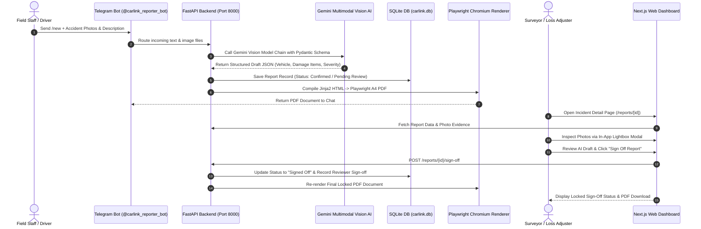

# Carlink AI Incident & Damage Reporting System — Technical Overview & Architecture

> [!NOTE]
> This document serves as the authoritative technical reference for the **Carlink System**, detailing system architecture, data flows, AI vision pipelines, PDF rendering, database schemas, dual-theme engine, and dashboard review workflows.

---

## 1. Executive Summary & Core Business Objective

Carlink System is an enterprise AI-assisted vehicle incident and damage reporting platform. It bridges field incident capture (via **Telegram Bot**) with office management, surveyor review, and claims processing (via **Next.js Web Dashboard**).

### Core Design Principles
1. **AI Drafts, Human Signs Off**: Multimodal vision AI automatically ingests accident photos and free-text notes to extract structured damage items, accident types, and severity levels. However, no report is final until a human reviewer/surveyor inspects and signs off.
2. **Structured Incident Data Over Raw PDF**: The database stores normalized structured data. The official PDF report is dynamically compiled from this structured data using headless Chromium rendering.
3. **Dual Entry Channels**: Incident reports can be filed on-the-go via chat apps (**Telegram / WhatsApp**) or created manually via the **Web Dashboard**.
4. **Modern UI & Dual-Theme System**: Featuring a state-of-the-art Dark Mode (Linear/Vercel Obsidian Midnight) & Light Mode (Stripe/Apple Clean Slate) theme engine with in-app photo lightbox inspection.

---

## 2. End-to-End System Architecture



---

## 3. Subsystem Breakdown

### A. Bot & Field Capture Service (`apps/bot-service`)
- **Telegram Channel Adapter** (`app/channels/telegram.py`): Handles chat sessions, state transitions (`/start`, `/new`, `/help`, `/cancel`), photo downloads, and interactive chat summaries.
- **Multimodal AI Extraction Engine** (`app/ai/`):
  - Model Chain Fallback: Configured via `GEMINI_MODEL_CHAIN` in `.env` (e.g. `gemini-2.5-flash, gemini-2.0-flash, gemini-1.5-flash`) to ensure zero downtime when hitting free-tier RPM/TPM rate limits.
  - Vision Processing: Analyzes photos and text in a single multimodal pass to detect damaged vehicle parts, damage mechanisms (dent, scratch, crack, structural), severity levels, and estimated incident timeline.
- **Playwright PDF Compiler** (`app/rendering/`):
  - Headless Chromium Driver: Uses Playwright to render pixel-perfect HTML/CSS templates into A4 print-ready PDF files.
  - Template Compliance: `security_incident.html` implements all 20 sections of the official *Car Incident Report Template PDF*.

### B. REST API & Database Layer (`app/api/` & `app/reports/`)
- **FastAPI Endpoints**:
  - `GET /reports`: List all filed incident reports with thumbnails and metadata.
  - `GET /reports/{id}`: Fetch complete incident data, photo URLs, and PDF download links.
  - `POST /reports`: Manual report filing endpoint for web dashboard.
  - `PUT /reports/{id}`: Edit incident data and trigger live PDF re-compilation.
  - `POST /reports/{id}/sign-off`: Update status to `Signed Off`, record surveyor sign-off, and lock PDF.
  - `GET /analytics/summary`: Aggregate stats for total incidents, severity breakdown, category counts, and activity logs.
  - `DELETE /reports/{id}`: Delete report and clean up storage files.
- **SQLite Database (`carlink.db`)**: Stores report metadata, status, photo file paths, PDF output paths, and structured draft JSON payload.

### C. Web Dashboard (`apps/dashboard`)
- **Next.js & TypeScript**: Responsive web interface for management, review, analytics, and admin settings.
- **Dual-Theme Engine (`ThemeToggle.tsx` & `globals.css`)**:
  - **Dark Mode**: Deep `#0b0f19` midnight background, slate glass cards (`#151c2c`) with glowing borders, electric cyan highlights (`#38bdf8`), and high-contrast typography.
  - **Light Mode**: Clean `#f8fafc` ice-slate background, crisp white cards (`#ffffff`) with soft drop-shadows, and royal indigo accents (`#4f46e5`).
  - **Theme Toggle**: Sun/Moon switch button in the top navigation bar with persistent `localStorage` memory and zero flash on load.
- **In-App Lightbox Photo Reviewer (`ImageLightbox.tsx`)**:
  - Full-screen modal overlay with blurred backdrop (`backdrop-filter: blur(12px)`).
  - Photo navigation (`Left`/`Right` arrow keys, `ESC` key, `‹` / `›` buttons) for reviewing evidence inside the application without opening external tabs.
- **Intelligent Fallback Engine**:
  - Description text parsing fallback for older or sparse report records (such as `CIR-2026-F7A3`), automatically populating vehicle details (`WX 8888 A`), default reporter information (`Alex Wong`), and structured damage summary items (`Fender / Wheel Arch`, `Minor Scratch & Paint Chipping`, `Minor`, `P01`, `91.2%`, `✓ Verified`).
- **Styled License Plate Badges**:
  - Monospace font (`.plate-badge` ➔ `WX 8888 A`) mimicking real registration plates.
- **Key Pages**:
  1. **Overview Home (`/`)**: High-level KPI stat tiles, 14-day frequency trends, category breakdown charts, and real-time activity feed.
  2. **Incident List (`/reports`)**: Searchable and filterable list by Incident ID, Location, Category, Severity, and Status.
  3. **Incident Detail & Reviewer Editor (`/reports/[id]`)**: Detailed vehicle overview grid, structured damage summary table with photo links & AI confidence scores, police & insurance details, AI vision insight callout, timeline, photo lightbox, audit log, and `SignOffButton`.
  4. **Manual Entry (`/reports/new`)**: Direct web form for entering vehicle accident data and generating PDFs.
  5. **Analytics & Trends (`/analytics`)**: Detailed incident trends, severity distribution, damage part frequency charts, and AI accuracy metrics.
  6. **Settings & Administration (`/settings`)**: User role management (Admin, Surveyor, Viewer), AI model fallback configuration, and PDF branding customization.

---

## 4. Comprehensive Data Schema (`SecurityIncidentDraft`)

| Field Name | Type | Description |
| :--- | :--- | :--- |
| `report_id` | `String` | Unique report identifier (e.g. `CIR-2026-0891`) |
| `company_name` | `String` | Company / Workshop branding text |
| `reporter_name` | `String` | Name of field staff or driver filing the report |
| `reporter_role` | `String` | Job title or role (Surveyor, Driver, Supervisor) |
| `vehicle_info` | `VehicleInfo` | Plate number, Make, Model, Year, Color, VIN, Engine No, Driver details |
| `incident_datetime`| `String` | Best-guess date & time of the collision |
| `location` | `String` | Highway, site bay, or address of incident |
| `weather_condition`| `String` | Clear, Rainy, Wet Surface, Night, Foggy |
| `road_condition` | `String` | Dry, Wet, Slippery, Gravel, Uneven |
| `traffic_condition`| `String` | Light, Moderate, Heavy |
| `category` | `List[String]` | Primary incident classification (`Vehicle Collision or Damage`, etc.) |
| `accident_type` | `String` | Mechanism (`Frontal Collision`, `Rear-End Collision`, `Side Impact`, etc.) |
| `severity_level` | `String` | `Minor (Cosmetic)`, `Moderate (Panel Repair)`, `Severe (Structural)` |
| `damage_summary` | `List[DamageSummaryItem]`| Structured table of damaged parts, damage types, severity, photo refs (`P01`), AI confidence %, and verification status |
| `description` | `String` | Narrative story drafted by AI from reporter input |
| `people_involved` | `List[PersonInvolved]` | Drivers, passengers, affected persons |
| `witnesses` | `List[Witness]` | Witness names, contacts, and statements |
| `immediate_actions`| `String` | Scene security, photo capture, vehicle movement |
| `police_report` | `PoliceReportDetails` | Reported status, station name, report number, officer name |
| `insurance_details`| `InsuranceDetails` | Insurer name, policy number, claim number, claim type, status, estimated cost |
| `ai_analysis` | `AIAnalysisInfo` | Vision detection summary, confidence score, suggested notes |
| `timeline` | `List[TimelineEvent]` | Chronological step timeline (Collision -> Photos -> Telegram -> Signed Off) |
| `recommendations` | `RecommendationsInfo` | Repair action plan, alignment inspection, disassembly requirements |
| `sign_off` | `SignOffInfo` | Prepared By, Reviewed By, Approved By, Signature status |

---

## 5. PDF Template Compliance Mapping (20-Section Standard)

The generated PDF report complies with all 20 sections defined in **Car Incident Report Template.pdf**:

1. **Title & Subtitle**: Formal header banner with "Car Incident Report".
2. **Header Info**: Custom Report ID, Date Created, Status badge pill.
3. **Reporter Info**: Name, position, department, contact details.
4. **Vehicle Info**: Grid of Plate Number, Make/Model, VIN/Chassis, Driver.
5. **Incident Details**: Date/Time, Location, Weather, Road, Traffic, Accident Type, Severity.
6. **Damage Summary Table**: Formatted table featuring Damaged Part, Damage Type, Severity pill, Photo Ref (`P01`), AI Confidence score, and Verified checkmark.
7. **Narrative Description**: Professional incident story text.
8. **People & Witnesses**: Detailed participant cards and witness quotes.
9. **Actions Taken**: Immediate on-site response details.
10. **Police Report**: Police station, report number, officer reference.
11. **Insurance & Claim**: Insurer name, policy/claim number, claim status, estimated cost.
12. **AI Vision Box**: Highlighted blue box containing AI vision tags, confidence score, and reviewer disclaimers.
13. **Timeline of Events**: Chronological timeline showing key milestones.
14. **Recommendations**: Recommended repair actions, inspection notes, and disassembly alerts.
15. **Additional Comments**: Extra notes or follow-up items.
16. **Photo Gallery**: Grid of incident photos with captions (`P01`, `P02`).
17. **Sign-Off Boxes**: Formal signature lines for Prepared By (Reporter), Reviewed By (Surveyor), Approved By (Manager).
18. **Page Layout**: A4 3-page printable page structure.
19. **Design Aesthetics**: Insurance-ready palette, clear typography, status pills.
20. **Vehicle Focus**: Built specifically for motor claims and vehicle incident inspection.

---

## 6. How to Run & Verify locally

### Running Backend Bot & API Service (`apps/bot-service`)
```powershell
cd "C:\Users\weika\OneDrive\Desktop\carlink system\apps\bot-service"
..\..\venv\Scripts\python.exe -m app.main
```

### Running Next.js Web Dashboard (`apps/dashboard`)
```powershell
cd "C:\Users\weika\OneDrive\Desktop\carlink system\apps\dashboard"
npm run dev
# Dashboard opens on http://localhost:3000
```
